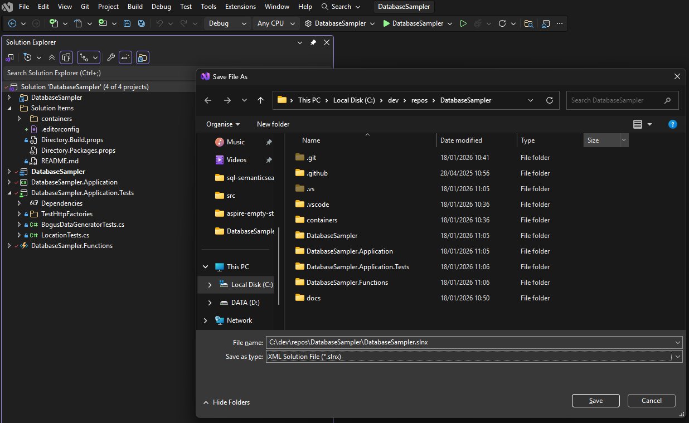

# Aspireifying on old .NET application

My DatabaseSampler project is something I wrote a few years ago to learn about data access in SQL Server, Postgres, Cosmos DB as well as how to use Redis for caching. Over the years I've upgraded it to new .NET versions, but now it's time to modernize it again.

Aspire has changed the game for .NET applications that need to work with multiple databases. It's now easy to set up a host application that spins up SQL Server and Postgres databases in local containers, start an emulator for Cosmos DB. So let's [aspireify](https://aspireify.net/)!

## Update to .slnx
I'll change the .sln file to the new XML format .slnx. Right click on the soltion in Visual Studio, Save as... and select Save as type XML Solution File. Close Visual Studio and repoen from the new `.slnx` file. The old `.sln` file can be deleted.



## Update to .NET 10

First I need to update the .NET version - it's already on 9.0 so changing it to 10.0 will be easy. I previously moved everything to file-scoped namespaces. This time I'm going to 

- centrally managed nuget
- Directory.Build.props exists but I'm going to add
  - Sonar
  - etc
- .editorconfig
- Copilot instructions!

Add new `.editorconfig file`. Visual Studio will do that for us; just right click on the solotion and select Add new EditorConfig from the menu.

### Central package management

Instead of every project having it's own versions of nuget packages, it's a good practive to move all versioning to a single file. This can be a bit labour-intensive so ket's just ask Copilot (other coding assistants are available!) to do it in Agent Mode:
```
Change this solution to use centrally managed nuget packages. Add a file `Directory.Packages.props` to the repo root folder with a property group that sets ManagePackageVersionsCentrally to true. Add all nuget packages used in the solution and update all .csproj files to use those versions.
```

If you want to do it by hand, add the `Directory.Packages.props` file like this:
```
<Project>
  <PropertyGroup>
    <ManagePackageVersionsCentrally>true</ManagePackageVersionsCentrally>
  </PropertyGroup>

  <ItemGroup>
    <PackageVersion Include="Azure.Identity" Version="1.13.2" />
    ...other ppackages...
  </ItemGroup>
</Project>
```

And in all nuget PackageReferences in project files just remove the version, like this:
```
  <PackageReference Include="Azure.Identity" />
```

Sometimes Visual Studio builds fail after this with errors saying "PackageReference items do not define a corresponding PackageVersion item" - if this hapopens just clean and rebuild, or as a last resort clean, close and reopen Visual Studio, and rebuild. If it still happens you might have missed one of the packages so you'll need to look at the detail.


### Directory.build.props

Add a nuget reference to `SonarAnalyzer.Csharp` by adding the following (using a valid recent version) to `Directory.Packages.props`:
```
  <PackageVersion Include="SonarAnalyzer.CSharp" Version="10.18.0.131500" />
```

Update the contents `Directory.build.props` to
```
<Project>
  <PropertyGroup>
    <TargetFramework>net9.0</TargetFramework>
    <ImplicitUsings>enable</ImplicitUsings>
    <Nullable>enable</Nullable>
    <AnalysisLevel>Latest</AnalysisLevel>
    <AnalysisMode>All</AnalysisMode>
    <TreatWarningsAsErrors>false</TreatWarningsAsErrors>
    <CodeAnalysisTreatWarningsAsErrors>false</CodeAnalysisTreatWarningsAsErrors>
    <EnforceCodeStyleInBuild>false</EnforceCodeStyleInBuild>
  </PropertyGroup>

  <ItemGroup>
    <PackageReference
      Include="SonarAnalyzer.CSharp"
      PrivateAssets="all"
      Condition="$(MSBuildProjectExtension) == '.csproj'" />
  </ItemGroup>

</Project>
```

Note that TreatWarningsAsErrors and EnforceCodeStyleInBuild are all false - I'll change them to tru later but there could be lots of build errors so let's start with false.

These lines can be removed from all `.csproj` files, since they will now be taken from `Directory.build.props` any any now-empty `<PropertyGroup>` sections removed:
```
    <TargetFramework>net9.0</TargetFramework>
    <ImplicitUsings>enable</ImplicitUsings>
    <Nullable>enable</Nullable>
```

## Upgrade to .NET 10 and upgrade nuget packages

Now we only need to change one place to upgrade to .net 10 - the FrameworkVersion in `Directory.build.props`. Change it to 
```
    <TargetFramework>net10.0</TargetFramework>
```

Now the solution won't build. This is the error:
```
Invalid combination of TargetFramework and AzureFunctionsVersion is set.
```
I double clicked on it and found the file it was coming from, which is a targets file in C:\Users\<user>\.nuget\packages\microsoft.azure.functions.worker.sdk\2.0.2\build. We're going to update to a newer version so hopefully the error will go away.

At this point we can update all nuget packages. I'm using Visual Studio so I just go to the manage nuget page and select all to update.If FluentAssertions appears don't update it because we're going to replace it soon.

Now it builds and the test all pass. There are a lot of build warnings but those can be cleaned up later.

## Tests

There aren't many tests so this won't take long. First I want to replace FluentAssertions with Shouldly, for reasons. 

After adding nuget references to Shouldly and removing FluentAssertions, the changes are mostly just things like

 - result.**Should().NotBeNull()** --> result.**ShouldNotBeNull**();
 - result.Latitude.**Should().Be**(51.50354); -> result.Latitude.**ShouldBe**(51.50354);

I tasked Copilot with doing this in agent mode, and it took ages and messed up the central package management, although it did ask if I wanted it to fix that at the end. But then it made things worse and I had to intervene...I probably need to use a higher model or add more instruction. I'll deal with that in the next section, but to be honest this would have been faster by hand than by agent.

I also want to upgrade to xUnit.net v3 - 
- install nuget package xunit.v3
- uninstall xunit
Add this to the test projects <PropertGroup>:
```
  <OutputType>Exe</OutputType>
```

In the tests I now have the following for Global usings
```
<ItemGroup>
  <Using Include="Shouldly" />
  <Using Include="Xunit" />
</ItemGroup>```

Any using statements in tests that references those can be removed.

I also added this to `.editorconfig` to stop the warnings about underscores in test names:
```
# Unit test project rules
[**/*Tests/**.cs]
dotnet_diagnostic.CA1707.severity = none # Allow underscores in test names
```

All the tests run correctly so it's time to move to the next step.

## Copiiot

Since I'm using Copilot a lot thse days, I asked it to create a copilot-instructions file for me, then added a few adjustments. Hopfully we'll have less chance of Copilot going off on long tangents. I also did some initial tidying on README.md.

## Adding Aspire AppHost and ServiceDefaults

Now it's time for the fun part - add an Aspire AppHost and an Aspire Service Defaults project. The .csproj files need monor tidying to make sure `TargetFramework`, `ImplicitUsings` and ``Nullable` are removed, and new nuget package references need to be copied to `Directory.Packages.props`.

There are a couple of annoying static type checks in ServiceDefaults, so I always add more error suppressed in `.editorconfig`, like so:
  ``` 
# Aspire ServiceDefaults project rules
[**/*ServiceDefaults/**.cs] 
dotnet_style_namespace_match_folder = false:silent # IDE0130
dotnet_diagnostic.CA1062.severity = none # CA1062:Validate arguments of public methods
dotnet_diagnostic.CA1307.severity = none # CA1307:Specify StringComparison for clarity
dotnet_diagnostic.S125.severity = silent # S125:Remove this commented out code
``` 

I'll also add a Shared project with some shared constants so we don't have magic strings all over the place. To avoid build errors this needs to be added to `editorconfig` too:
```
# Shared project rules
[**/*Shared/**.cs]
# CA1716: Identifiers should not match keywords. Allow in NameSpace to fix conflict with reserved language keyword 'Shared'
dotnet_code_quality.CA1716.analyzed_symbol_kinds = NamedType, Method, Property, Event, Parameter
```

The Shared project needs to be added as a project reference to `AppHost`, `DatabaseSampler` and `DatabaseSampler.Functions`. 
In `AppHost.csproj` the project reference needs to marked as not being an Aspire resource:
```
    <ProjectReference Include="..\src\DatabaseSampler.Shared\DatabaseSampler.Shared.csproj" IsAspireProjectResource="false" />
```

**NOTE** - the project is not under src/ in the initial version, but will be moved later.

`DatabaseSampler` and `DatabaseSampler.Functions` are going to use ServiceDefaults, so add project references in them to the new `DatabaseSampler.ServiceDefaults\ project. Update nuget packages in case the versions from the Aspire template were out of date.

The AppHost needs references to the website and functions, so add those references then edit `AppHost.csproj` to set project metadata type names, like this:

```
    <ProjectReference Include="..\DatabaseSampler.Functions\DatabaseSampler.Functions.csproj" AspireProjectMetadataTypeName="Functions" />
    <ProjectReference Include="..\DatabaseSampler\DatabaseSampler.csproj" AspireProjectMetadataTypeName="Website" />
```

Those names can be used in `AppHost.cs` to make the code easier to read.


## Adding databases

Databases for SQL Server and Postgres are now created in the AppHost, so we don't need to include them in any initialisation scripts.

In the old version, there was a manual script to create the Postcodes table in SQL Server, and a manual step to run migrations for Postgres. Both these can be done using database setup projects. All the work could be done in a single service project, but Microsoft recommends separate services so I added
 - `DatabaseSampler.Postgres.MigrationService` as a new Worker Service that runs Postgres migrations
 - `DatabaseSampler.SqlServer.Deploy` as a simple console application that uses DbUp to run SQL Server scripts.

I had problems trying to check the migrations so I just deleted the migrations from the Application file and ran this in the web project.

[Apply EF Core migrations in Aspire](https://aspire.dev/integrations/databases/efcore/migrations/)

I followed the example and added a transaction around the migrations, but this failed with 

> A transaction was started before applying migrations. This prevents a database lock to be acquired and hence the database will not be protected from concurrent migration applications. The transactions and execution strategy are already managed by EF as needed. Remove the external transaction.

After removing the transaction it worked.


Problem:
Migration shows error 


Problem on create student:
Microsoft.EntityFrameworkCore.DbUpdateException: 'An error occurred while saving the entity changes. See the inner exception for details.'

```
dotnet ef migrations add InitialCreate --context StudentDbContext --project ..\DatabaseSampler.Application\DatabaseSampler.Application.csproj
```
it was "unable to determine which migrations have been applied. This can happen when your project uses a version of Entity Framework Core lower than 5.0.0 or when an error occurs while accessing the database.

Problem on first attempt to save student:
    "Cannot write DateTime with Kind=Local to PostgreSQL type 'timestamp with time zone', only UTC is supported. Note that it's not possible to mix DateTimes with different Kinds in an array, range, or multirange. (Parameter 'value')"
    This is a breaking change in EF Core - see [this Stackoverflow post](https://stackoverflow.com/questions/69961449/net6-and-datetime-problem-cannot-write-datetime-with-kind-utc-to-postgresql-ty).
    The fixes are either to add this to the startup code:
    ```
        AppContext.SetSwitch("Npgsql.EnableLegacyTimestampBehavior", true);
    ```    
    or make sure the date column is UTC format. This is the better fix, and is as simple as adding `.ToUniversalTime()` to the Bogus data generator date rule:
    ```
    .RuleFor(s => s.Created, f => f.Date.Past().ToUniversalTime())
    ```

## Redis

See the [Redis integration](https://aspire.dev/integrations/caching/redis/) guide.

In the old version, I had a docker file to bring up Redis but it was a manaul process. Now all we need to do is include Redis in the AppHost:
```
var redis = builder.AddRedis(ResourceNames.Redis);
```

and pass it to the web project, then in the web project, remove
```
        var redisConnectionString = Configuration["RedisConnectionString"];
        services.AddStackExchangeRedisCache(options => {
            options.Configuration = redisConnectionString;
            options.InstanceName = "";
       });
```
and replace it with 
```
        services.AddRedisCache(appHost.GetRedisConnectionString());
```

The `containers` folder with `docker-compose.yml` can be removed from the solution and deleted from disk.


## Web project startup

The startup code in Program.cs and Startup.cs is out of date - there's even a build warning saying that IHost is obsolete. WebHostBuilder has been [deprecated](https://github.com/aspnet/Announcements/issues/526) so we need to replace everything with a new builder. 
This probably makes things simpler because the old Startup code can also be thrown away.

Change Program.cs to this:
```
var builder = WebApplication.CreateBuilder(args);

builder.AddServiceDefaults();

builder.Services.AddControllersWithViews();

var app = builder.Build();

app.MapDefaultEndpoints();

if (!app.Environment.IsDevelopment())
{
    app.UseExceptionHandler("/Home/Error");
    app.UseHsts();
}

app.UseHttpsRedirection();
app.UseRouting();

app.UseAuthorization();

app.MapStaticAssets();

app.MapControllerRoute(
    name: "default",
    pattern: "{controller=Home}/{action=Index}/{id?}")
    .WithStaticAssets();

await app.RunAsync().ConfigureAwait(true);
```

`Startup.cs` can be deleted.

## Function app

The function app startup can also be rewritten to use the new `FunctionsApplicationBuilder`, and also needs to use Aspire ServiceDefaults. 
```
```

Several nuget packages can be removed from this project after adding the Aspire packages, including:
```

```

The `local.settings.json` file was previously in .gitignore, but now that settings come from AppHost the .gitignore file can be removed from the functions project and if present these lines can be removed:
```
    "PostgreSQLConnectionString": "...",
    "PostgreSQLDbPassword": "..."
```


All settings will come from AppHost now, so the following files are no longer needed in the projects and can be removed or commented out of `.gitignore`:
```
# Local configuration files
# appsettings.Development.json
# local.settings.json
```

Functions have been changed to use a more modern style, including primary constructors, injected logger and new logger syntax.
I added 
```
builder.ConfigureFunctionsWebApplication();
```
I changed the functyions to use an ASP.NET MVC style routing, so the function names are now just the HTTP method, and the route is defined in the attribute, like this:
```
    [Function("GetStudents")]
    [HttpGet("/students")]
    public async Task<IActionResult> GetStudents()
```

## Cosmos DB

I've set this up to use the preview emulator image so I can add the Data Explorer. This caused some issues on startup

I had problems getting it to start. In the Aspire console the instance stayed unhelthy, and looking at the console logs it was " pgcosmos readiness check still waiting for Postgres startup".
Eventually I went to look at the log in the container. Either look for container name and use it in a docker command:
```
docker ps | grep cosmos # bash
docker ps | wsl grep cosmos # works on Windows Terminal
```

```
docker exec <container-name> cat /logs/pglog.log
```

or go to the container in Docker Desktop, fund the Exec tab, run `/bin/bash` and 
```
cat /logs/pglog.log
```

This had an error 
```
FATAL:  could not load server certificate file "/home/cosmosdev/cosmosdev.crt": No such file or directory
```

After some searching, I found I had an old copy of CosmosDBEmulator installed on my machine, so I uninstalled that.
I then ran `certmgr.msc` (or `certlm.msc`) and looked at Certificates > Personal > Certificates. There were multiple copies of these certificates for localhost. 
 - CosmosEmulatorSecrets
 - DocumentDbEmulatorCertificate 
I deleted those and when I ran the AppHost again everything started correctly.


## TODO 

- Set *TreatWarningsAsErrors and EnforceCodeStyleInBuild to true and fix errors.
- this was added by copilot in Directory.Build.props - should I put it back:
```
  <AzureCosmosDisableNewtonsoftJsonCheck>true</AzureCosmosDisableNewtonsoftJsonCheck>
```
See [Missing Newtonsoft.Json Reference](https://learn.microsoft.com/en-us/azure/cosmos-db/best-practice-dotnet#missing-newtonsoftjson-reference)
  > per Copilot "Added AzureCosmosDisableNewtonsoftJsonCheck to bypass the Azure Cosmos SDK's Newtonsoft.Json check (so build succeeds without explicitly adding Newtonsoft.Json)"

- Move projects into src folder - do this after merge to main to preserve some history.

## Deploying to Azure

- Parameter to say we are running locally? Or just use IsDevelopment
- IsPublishing? What does that do?


## Wrapping up

Aspire made this easy, but removing old code made it harder.

Once I got it running I saw a few things I wasn't happy with. This code was written to help me learn new concepts, but since then I've learned a lot more and I just had to fix some of the gaps.


## Links

 - Aspireify DatabaseSampler - emulators for now, next step - deploy to Azure
	[aspireify.NET](https://aspireify.net/)

	https://aspireify.net/a/241216/add-sql-server-database-with-seed-data-to-.net-aspire-during-app-startup
	https://aspireify.net/a/250709/how-to-have-gitlab-cicd-for-a-.net-aspire-project

- Repo with database migration examples - [SQL Server Aspire Samples](https://github.com/Azure-Samples/azure-sql-db-aspire)


** Icons **
See https://blog.leadingedje.com/post/aspire/cozydashboarding.html
    https://storybooks.fluentui.dev/react/?path=/docs/icons-catalog--docs
.WithIconName("Globe")
